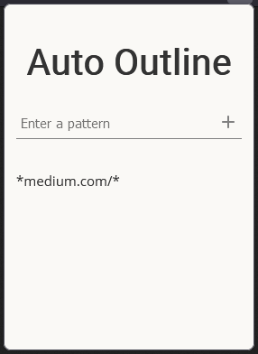

# Auto Outline 

This is a Firefox extension that automatically redirects urls matched by a wildcard pattern to outline.com. This extension is built using React and Typescript.



## How To Install

Download the latest XPI file from the releases tab and open it using Firefox. It will then prompt you to install it.

## Building Instructions

To clone and build this extension you need Git and Node.js installed.

```b# Clone this repository
$ git clone https://github.com/patrickmackow/auto-outline

# Go into the repository
$ cd auto-outline

# Install dependencies
$ npm install

# Run the watch script
$ npm run watch
```

Webpack watches for any changes and automatically emits the bundle to the `build/` directory. These files can be loaded into Firefox temporarily using the [about:debugging](https://developer.mozilla.org/en-US/docs/Tools/about:debugging) page
